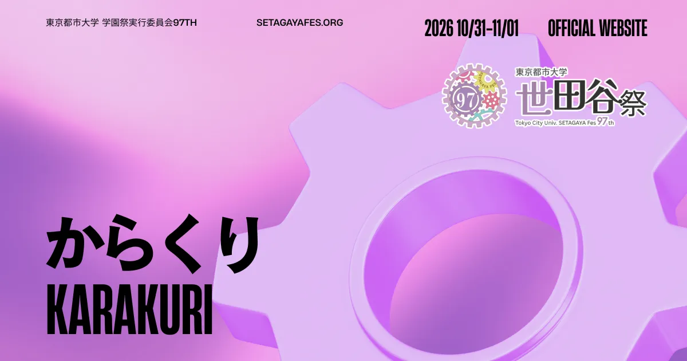

<div align="center">
  
</div>

# 東京都市大学 第97回 世田谷祭 公式Webサイト

東京都市大学 世田谷キャンパスで開催される学園祭「第97回 世田谷祭」の公式Webサイトです。

**開催日程** 2026年10月31日（土）〜 11月1日（日）10:00 - 19:30
**会場** 東京都市大学 世田谷キャンパス

---

## 技術スタック

| カテゴリ         | 技術                                                                                           |
| ---------------- | ---------------------------------------------------------------------------------------------- |
| フレームワーク   | [Next.js 16.1](https://nextjs.org/) (App Router)                                               |
| 言語             | TypeScript                                                                                     |
| スタイリング     | [TailwindCSS 4](https://tailwindcss.com/)                                                      |
| アニメーション   | [GSAP](https://greensock.com/)                                                                 |
| 3Dグラフィックス | [Three.js](https://threejs.org/) / [React Three Fiber](https://docs.pmnd.rs/react-three-fiber) |
| CMS              | [microCMS](https://microcms.io/)                                                               |
| フォーム         | React Hook Form + Zod                                                                          |
| 多言語対応       | [next-intl](https://next-intl.dev/)                                                            |
| ホスティング     | [Vercel](https://vercel.com/)                                                                  |

---

## セットアップ

**前提条件**: Node.js >= 24 / pnpm

```bash
git clone https://github.com/ManatoYamashita/tcu-setagayafes97-web.git
cd tcu-setagayafes97-web
pnpm install
cp .env.example .env.local
```

### 環境変数（`.env.local`）

| 変数名                    | 説明                      | 必須 |
| ------------------------- | ------------------------- | :--: |
| `MICROCMS_SERVICE_DOMAIN` | microCMS サービスドメイン | Yes  |
| `MICROCMS_API_KEY`        | microCMS API キー         | Yes  |
| `NEXT_PUBLIC_URL`         | サイトの公開URL           | Yes  |
| `NEXT_PUBLIC_GTM_ID`      | Google Tag Manager ID     |  -   |
| `SMTP_HOST` / `SMTP_PORT` | SMTP サーバー設定         |  -   |
| `SMTP_USER` / `SMTP_PASS` | SMTP 認証情報             |  -   |
| `CONTACT_TO_EMAIL`        | お問い合わせ送信先        |  -   |
| `CONTACT_FROM_EMAIL`      | お問い合わせ送信元        |  -   |

#### コンテンツ公開フラグ

`"true"` のときだけ公開する。未設定・それ以外の値はすべて非公開（安全側デフォルト）。**ビルド時に評価されるため、値を変えたら再ビルド・再デプロイが必要。**

| 変数名                        | 制御対象                                                        |
| ----------------------------- | --------------------------------------------------------------- |
| `NEXT_PUBLIC_EVENTS_VISIBLE`  | `/events`・`/timetable`・おすすめ企画・企画詳細・sitemap の企画 |
| `NEXT_PUBLIC_NEWS_VISIBLE`    | `/info` 一覧                                                    |
| `NEXT_PUBLIC_SPECIAL_VISIBLE` | 著名人企画（`type = special`）全般。`EVENTS_VISIBLE` とは独立   |

組み合わせ表と注意点は [docs/dev/ci-env.md](./docs/dev/ci-env.md#コンテンツ公開フラグ) を参照。

### 開発コマンド

| コマンド            | 説明                       |
| ------------------- | -------------------------- |
| `pnpm dev`          | 開発サーバー起動           |
| `pnpm build`        | プロダクションビルド       |
| `pnpm start`        | プロダクションサーバー起動 |
| `pnpm lint`         | ESLint チェック            |
| `pnpm format`       | Prettier 自動修正          |
| `pnpm format:check` | フォーマットチェック       |
| `pnpm analyze`      | バンドル分析               |

---

## ディレクトリ構成

```
src/
├── app/                  # Next.js App Router ページ
│   ├── [locale]/         # 多言語ページ (en, zh, ko)
│   ├── about/            # 委員会・協賛・お問い合わせ・プライバシー
│   ├── api/              # API Routes
│   ├── events/           # 企画検索・詳細
│   ├── info/             # お知らせ・FAQ・ガイド・パンフレット
│   ├── map/              # マップ・アクセス
│   └── timetable/        # タイムテーブル
├── components/           # React コンポーネント
│   ├── home/             # トップページ用
│   ├── three/            # 3D歯車 (React Three Fiber)
│   ├── layout/           # ヘッダー・フッター
│   ├── ui/               # 汎用UIパーツ
│   └── seo/              # SEO関連
├── data/                 # 静的コンテンツ管理 (TS)
├── lib/                  # ユーティリティ・microCMSクライアント
├── messages/             # 多言語翻訳ファイル (ja/en/zh/ko)
└── assets/               # 静的アセット（画像・動画）
```

---

## ブランチ戦略・コミット規約

`main` への直接 push は禁止。すべてフィーチャーブランチ → PR 経由でマージ。

**ブランチ命名**: `feature/xxx` / `bugfix/xxx` / `hotfix/xxx` / `docs/xxx` / `refactor/xxx`

**コミットメッセージ**: `PREFIX: メッセージ`

> `FEATURE` `FIX` `REFACTOR` `STYLE` `DOC` `TEST` `CHORE` `PERF` `CI`

---

## ドキュメント

プロジェクトドキュメントは `docs/` で管理しています。

- [ドキュメント索引](docs/INDEX.md)
- [要件定義書](docs/requires/require.md)
- [開発タスク](docs/requires/todo.md)
- [Git・CI/CD](docs/dev/git.md)
- [デザインシステム](docs/frontend/design.md)
- [レイアウトパターン](docs/frontend/layout-patterns.md)

---

## ライセンス

Private - All Rights Reserved
