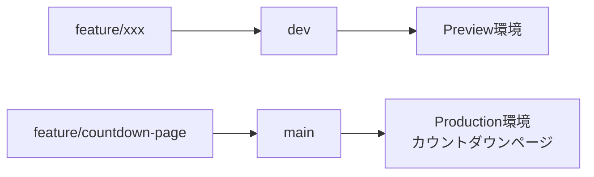

# ブランチ戦略（カウントダウンページ運用フロー）

**最終更新日:** 2026-02-08
**ステータス:** 運用中

## 概要

2026年2月28日公開予定の第97回世田谷祭Webサイトについて、段階的公開（カウントダウンページ → 本番ページ）を実現するブランチ戦略を定義します。

**目的:**

- 2/28にシンプルなカウントダウンページを公開
- 本番ページの開発を並行して進行
- 11/1に本番ページへスムーズに切り替え

## ブランチ構成

### main（本番ブランチ）

- **用途:** Vercel Production環境にデプロイ
- **公開タイミング:**
  - 2/28〜10/31: カウントダウンページ
  - 11/1以降: 本番ページ（devからマージ）
- **直接コミット禁止:** 必ずPR経由でマージ
- **保護設定:** GitHub Branch Protectionを推奨

### dev（長期開発ブランチ）

- **用途:** 本番ページの開発ブランチ
- **マージ元:** feature/xxx, bugfix/xxx
- **マージ先:** main（カウントダウン終了後）
- **Vercelデプロイ:** Preview環境（自動デプロイ）
- **ライフサイクル:** 長期運用（カウントダウン期間中も継続）

### feature/xxx（機能開発ブランチ）

- **用途:** 新機能開発、バグ修正
- **マージ先:** dev
- **ライフサイクル:** 短期（1週間〜2週間）
- **命名規則:** `feature/<feature-name>`, `bugfix/<bug-name>`

**例:**

- `feature/event-search-page` - 企画検索ページの実装
- `feature/3d-campus-map` - 3Dキャンパスマップの実装
- `bugfix/countdown-timer-fix` - カウントダウンタイマーのバグ修正

### feature/countdown-page（カウントダウンページ専用）

- **用途:** カウントダウンページ開発・修正
- **マージ先:** main（直接マージ可）
- **ライフサイクル:** 2/28公開まで
- **削除タイミング:** カウントダウンページ公開後（PR マージ後）

## 運用フロー

### フェーズ1: カウントダウンページ公開まで（〜2/28）



**作業フロー:**

1. 本番ページの機能開発: `feature/xxx` → `dev` → Preview環境で確認
2. カウントダウンページ修正: `feature/countdown-page` → `main` → Production環境で確認

### フェーズ2: カウントダウン期間（2/28〜10/31）

**ブランチ状態:**

- `main`: カウントダウンページ（Production）
- `dev`: 本番ページ開発継続（Preview環境で確認可能）
- `feature/xxx`: 本番ページの機能追加・バグ修正 → `dev`にマージ

**注意事項:**

- カウントダウン期間中に`main`を直接更新しない（緊急修正を除く）
- `dev`ブランチは定期的に`main`をマージして最新化（コンフリクト防止）

**定期マージコマンド（週1回推奨）:**

```bash
git checkout dev
git pull origin dev
git merge main --no-ff
git push origin dev
```

### フェーズ3: 本番ページ公開後（11/1以降）

**devをmainにマージ:**

```bash
git checkout main
git pull origin main
git merge dev --no-ff -m "$(cat <<'EOF'
RELEASE: 本番ページ公開（第97回世田谷祭）

- カウントダウンページから本番ページに切り替え
- 全機能実装完了（企画検索、タイムテーブル、3Dマップ等）
- microCMS連携確認済み

Co-Authored-By: Claude Sonnet 4.5 <noreply@anthropic.com>
EOF
)"
git push origin main
```

**公開後の運用:**

- `dev`ブランチは削除せず、継続的な開発に使用
- 機能追加・バグ修正: `feature/xxx` → `dev` → `main`

## Vercel設定

### Production Branch設定

- **Production Branch:** `main`
- **自動デプロイ:** 有効
- **公開URL:** https://setagayafes.tcu.ac.jp（または Vercel 提供 URL）

### Preview Branch設定

- **自動プレビュー:** 有効
- **プレビュー対象:** `dev`, `feature/*`, `bugfix/*`
- **Preview URL:** `https://<branch-name>-<project-name>.vercel.app`

### 環境変数設定

以下の環境変数を設定（Production / Preview 共通）:

- `NEXT_PUBLIC_MICROCMS_SERVICE_DOMAIN`
- `NEXT_PUBLIC_MICROCMS_API_KEY`

**確認方法:**
Vercel Dashboard → Settings → Environment Variables

### ビルド設定

- **Framework Preset:** Next.js
- **Build Command:** `pnpm build`
- **Output Directory:** `.next`
- **Install Command:** `pnpm install`
- **Node Version:** 20.x

## トラブルシューティング

### mainとdevのコンフリクト

**原因:** mainに直接修正が入り、devとの差分が発生

**解決策:**

```bash
# devでmainをマージして解決
git checkout dev
git pull origin dev
git merge main
# コンフリクト解消後
git add .
git commit -m "MERGE: mainをdevにマージ（コンフリクト解消）"
git push origin dev
```

### 緊急修正（hotfix）

**シナリオ:** カウントダウンページに重大なバグが発見された

**対応手順:**

```bash
# mainから直接hotfixブランチを作成
git checkout main
git pull origin main
git checkout -b hotfix/urgent-fix

# 修正後、mainに直接PR
git add .
git commit -m "HOTFIX: 緊急修正 - xxx"
git push -u origin hotfix/urgent-fix
gh pr create --base main --title "HOTFIX: 緊急修正 - xxx"
```

**マージ後:**

```bash
# devにもhotfixを反映
git checkout dev
git pull origin dev
git merge main
git push origin dev
```

### Vercel自動デプロイ失敗

**確認事項:**

1. Vercel Dashboard → Deployments でエラーログを確認
2. ビルドエラーの場合: ローカルで `pnpm build` を実行して再現
3. 環境変数の設定ミス: Settings → Environment Variables を確認

**手動デプロイ:**

```bash
# Vercel CLIでデプロイ
vercel --prod
```

### devブランチのPreview環境が古い

**原因:** devブランチに新しいコミットがpushされていない

**解決策:**

```bash
git checkout dev
git pull origin dev
# 空コミットでデプロイをトリガー
git commit --allow-empty -m "CHORE: Preview環境を更新"
git push origin dev
```

## ベストプラクティス

### コミットメッセージ

**フォーマット:** `PREFIX: メッセージ`

| PREFIX     | 用途             |
| ---------- | ---------------- |
| `FEATURE`  | 新機能追加       |
| `FIX`      | バグ修正         |
| `REFACTOR` | リファクタリング |
| `STYLE`    | スタイル変更     |
| `DOC`      | ドキュメント更新 |
| `CHORE`    | ビルド・設定変更 |
| `HOTFIX`   | 緊急修正         |
| `RELEASE`  | リリース         |

### PR作成時のチェックリスト

- [ ] ローカルでビルドが成功（`pnpm build`）
- [ ] TypeScriptの型エラーなし
- [ ] Prettierでフォーマット済み
- [ ] PRのタイトルがコミットメッセージ規約に準拠
- [ ] PR本文に実装内容・テスト結果を記載

### devブランチの定期メンテナンス

**週1回の作業（推奨）:**

```bash
# mainの最新をdevにマージ
git checkout dev
git pull origin dev
git merge main --no-ff
git push origin dev

# 不要なfeatureブランチを削除
git branch --merged dev | grep -v "^\*\|main\|dev" | xargs -n 1 git branch -d
```

## 参考リンク

- [GitHub Flow](https://docs.github.com/en/get-started/quickstart/github-flow)
- [Vercel Git Integration](https://vercel.com/docs/concepts/git)
- [Next.js Deployment](https://nextjs.org/docs/deployment)

## 変更履歴

| 日付       | 変更内容 | 担当者           |
| ---------- | -------- | ---------------- |
| 2026-02-08 | 初版作成 | フリーザ様（AI） |
